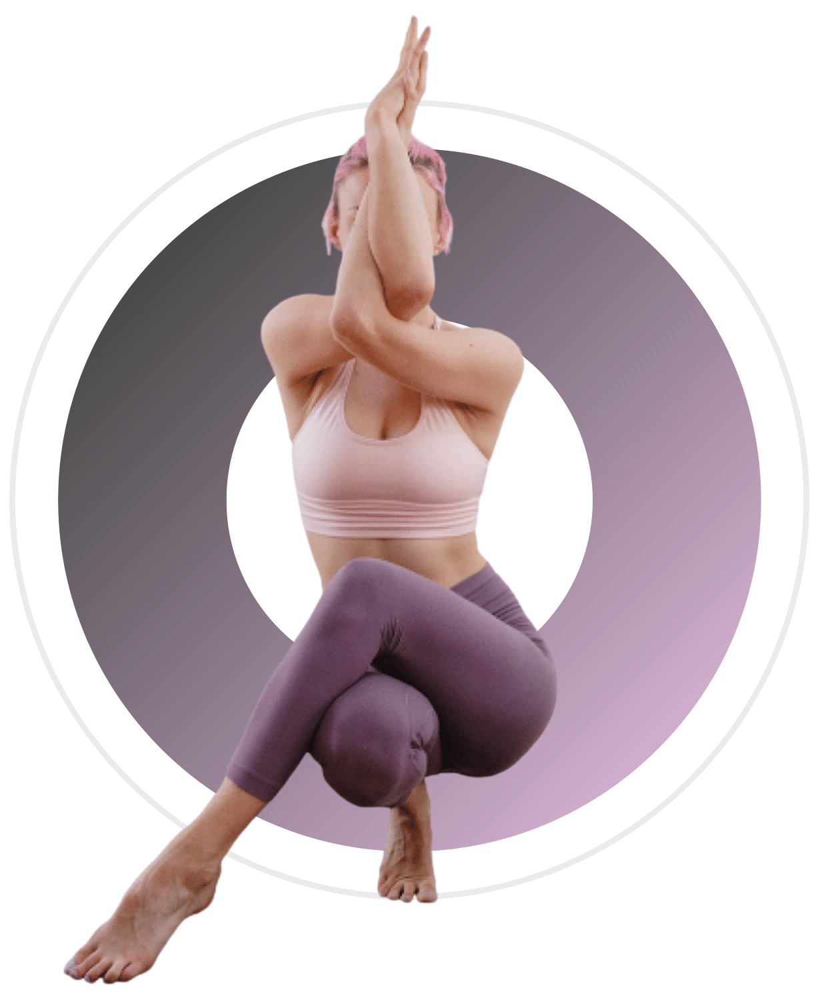

# 🧘 Yoga Club — Landing Page

> A modern, fully responsive yoga studio website with automatic multilingual support (EN / FR / ES / DE), smooth scroll animations, and a complete multi-section layout.

<p align="center">
  
</p>

---

## 🌐 Live Preview

Open `index.html` in your browser — no build step required.

---

## ✨ Features

- **Multilingual (i18n)** — Auto-detects the user's country via IP and switches language automatically
  - 🇬🇧 English · 🇫🇷 French · 🇪🇸 Spanish · 🇩🇪 German
  - Manual switcher with flag icons in the navbar
  - Language preference saved in `localStorage`
- **Fully Responsive** — Mobile-first design, adapts to all screen sizes
- **Smooth Animations** — ScrollReveal entrance animations on every section
- **Fixed Navbar** — With hamburger menu on mobile, horizontal nav on desktop
- **6 Complete Sections** — Hero, Services, About, Classes, Meditation Banner, Contact
- **Footer** — 4-column layout with quick links, class list, schedule and socials
- **Contact Form** — Styled inputs with focus states, translated placeholders
- **No Framework** — Pure HTML, CSS and Vanilla JavaScript

---

## 📸 Sections

| # | Section | Description |
|---|---------|-------------|
| 1 | **Hero / Header** | Full headline, CTA button, social links, yoga image |
| 2 | **Services** | 4 cards — Hatha Yoga, Meditation, Vinyasa Flow, Yin Yoga |
| 3 | **About** | Studio story, 3 key stats (experience, members, instructors) |
| 4 | **Classes** | 3 photo cards with schedule and pricing |
| 5 | **Meditation Banner** | Atmospheric split layout with candle image |
| 6 | **Contact** | Address, phone, email, hours + contact form |
| 7 | **Footer** | Logo, description, socials, quick links, schedule |

---

## 🌍 Language Detection Logic

```
1. Check localStorage (returning visitor preference)
2. Fetch user country via ipapi.co API (3s timeout)
3. Map country code → language (FR/BE/MA → fr, ES/MX/AR → es, DE/AT/CH → de)
4. Fallback to browser navigator.language
5. Default → English
```

---

## 🛠️ Tech Stack

| Technology | Usage |
|------------|-------|
| HTML5 | Semantic structure, `data-i18n` attributes |
| CSS3 | Custom properties, Grid, Flexbox, responsive breakpoints |
| JavaScript (ES6+) | i18n engine, IP detection, ScrollReveal, menu toggle |
| [ScrollReveal](https://scrollrevealjs.org/) | Entrance animations |
| [Remix Icon](https://remixicon.com/) | Icon library |
| [flagcdn.com](https://flagcdn.com/) | Flag images for language switcher |
| [ipapi.co](https://ipapi.co/) | IP geolocation for auto language detection |

---

## 📁 Project Structure

```
yoga-club/
├── index.html          # Main HTML with data-i18n attributes
├── styles.css          # All styles (mobile-first, variables, sections)
├── main.js             # Translations, language detection, animations
└── assets/
    ├── logo-white.png
    ├── logo-dark.png
    ├── header.png
    ├── image1.jpg      # Hero section
    ├── image2.jpg      # Outdoor Yoga class card
    ├── image3.jpg      # About section
    ├── image4.jpg      # Group Sessions class card
    ├── image5.jpg      # Meditation banner
    └── image6.jpg      # Advanced Flow class card
```

---

## 🚀 Getting Started

```bash
# Clone the repository
git clone https://github.com/YOUR_USERNAME/yoga-club.git

# Open in browser
open index.html
# or simply double-click index.html
```

> No dependencies to install. No build step. Just open and go.

---

## 🎨 Design System

| Token | Value |
|-------|-------|
| Primary color | `#9a4b7b` |
| Primary dark | `#782a59` |
| Text dark | `#333333` |
| Background accent | `#fdf5f9` |
| Font | Montserrat (Google Fonts) |
| Max width | `1200px` |

---

## 📱 Responsive Breakpoints

| Breakpoint | Layout |
|------------|--------|
| `< 768px` | Single column, hamburger menu, stacked sections |
| `≥ 768px` | Two-column grids, horizontal nav, side-by-side layouts |

---

## 📄 License

MIT — free to use and modify.

---

*Built with HTML · CSS · Vanilla JS*
